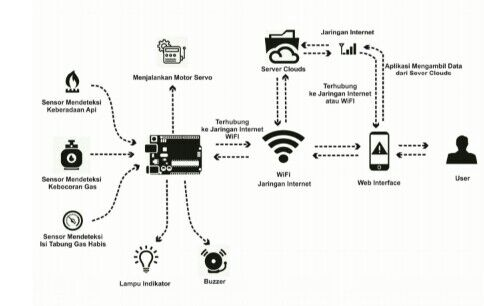
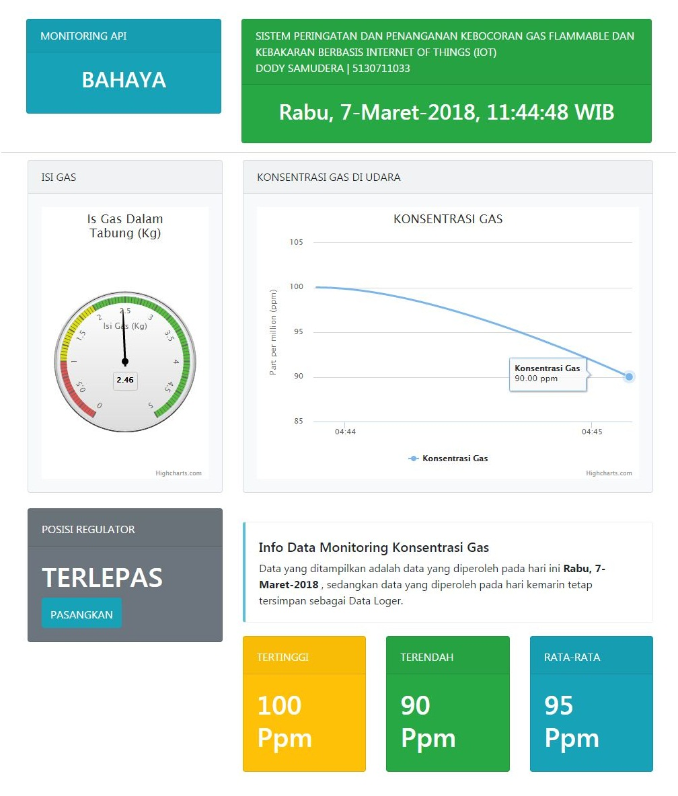
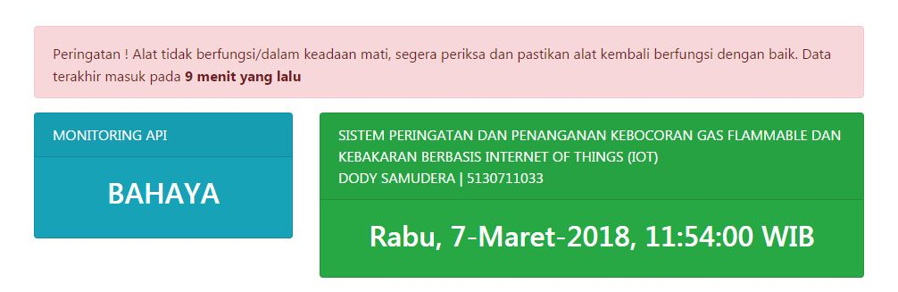

#DASHBOARD IOT PROJECT
Dashboard ini dibangun menggunakan komponen :
Bootstrap 4.0

#Desain Sistem

#Screenshot

#Screenshot Offline

#Instalasi
Upload file yang ada pada folder /file Arduino/ ke Board NodeMCU 12 E atau versi NodeMCU lain

#Struktur Folder
|-- assets
|   |-- css //Folder ini hanya untuk tampilan saja, contoh warna, ukuran font, dll
|   |-- Ionicons //Folder ini hanya untuk menampilkan Icon-icon, seperti icon max, min, dll
|   `-- js
|		|--bootstrap.min.js //File ini hanya untuk tampilan saja
|		|--data.js	// File ini untuk menampilkan data secara ajax (Tanpa Refresh Browser) dari data yang tampil di File function/data.php
|		|--highcharts-more.js //File ini hanya untuk tampilan saja
|		|--highchart.js	//File ini hanya untuk tampilan saja
|		|--isi-gas.js	//File ini untuk menampilkan Data secara ajax (Tanpa Refresh Browser) dari data yang tampil di File function/data.php
|		|--jam.js //File ini untuk menampilkan Jam [Hari - Tanggal - Waktu jam sekarang]
|		|--jquery.min.js //File ini hanya untuk tampilan saja
|		|--konsentrasi-gas.js //File ini untuk menampilkan Data secara ajax (Tanpa Refresh Browser) dari data yang tampil di File function/konsentrasi-gas.php
|		|--kontrol-regulator.js //File ini untuk mengontrol regulator dengan cara melakukan request ke File function/kontrol-regulator.php
|		`--waktu-peringatan.js //File ini untuk menampilkan Peringatan kalo Data tidak dikirim lebih dari 5 Menit, file ini merequest dari File function/waktu-peringatan.php
|-- config
|	`-- config.php //File ini untuk pengaturan Koneksi Ke Database
|-- function
|	|-- average.php //File ini untuk menampilkan Rata-rata data Konsentrasi Gas
|  	|-- data.php
|	|-- isi-gas.php
|  	|-- konsentrasi-gas.php
|	|-- kontrol-regulator.php
|  	|-- max.php //File ini untuk menampilkan Nilai Tertinggi dari data Konsentrasi Gas
|	|-- min.php //File ini untuk menampilkan Nilai Terendah dari data Konsentrasi Gas
|  	|-- posisi-regulator.php
|	|-- update.php //File ini untuk mengirim data dari Request NodeMCU
|	`-- waktu-peringatan.php //File ini untuk menampilkan Waktu Terakhir data dikirim oleh NodeMCU
`-- index.php

Logikanya :
File2 yang ada di Folder function/** hanya untuk menampilkan data dari DATABASE, sedangkan yang bertugas untuk menampilkan
ke website adalah file2 yang ada di folder assets/js/** [sesuai nama, misal waktu-peringatan.php -> waktu-peringatan.js]
*Catatan : Untuk file average.php, max.php, dan min.php ditampilkan oleh file function/data.js

## License

* The scripts are license under: [MIT](license.md).

## Find Me On
GITHUB [Muhammad Sidik 354](https://github.com/muhammad354)
FACEBOOK [Muhammad Sidik](https://facebook.com/sidik.javanese)
INSTAGRAM [Javanese354](https://instagram.com/javanese354)
TWITTER [Javanese354](https://twitter.com/@javanese354)
GMAIL (javanese354@gmail.com)

## Copyleft Muhammad Sidik - 2018
